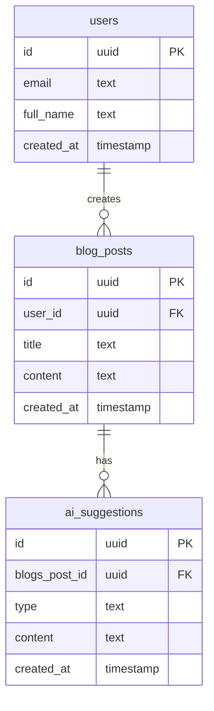

# DraftMaster

**DraftMaster** is a modern, AI-powered blog writing platform built with Vue 3, Supabase, and OpenAI (Llama 3.1 LLMs). It helps you write smarter, faster, and more creatively with features like AI-generated titles, summaries, and SEO keywords, plus local draft management.

---

## Features

- **Vue 3 SPA** with a clean, responsive UI (Bootstrap-based)
- **AI Suggestions**: Instantly generate blog titles, summaries, and keywords using OpenAI or compatible LLMs
- **Draft Management**: Save, view, and load drafts locally in your browser
- **History Panel**: Browse your AI suggestions and drafts by type (Titles, Summary, Keywords, Drafts)
- **Supabase Auth**: Google login, user data stored in Supabase
- **Stats Panel**: See word count, character count, and estimated reading time
- **No backend required for drafts**: All drafts and suggestion history are stored in localStorage for privacy and speed

---

## Setup

### 1. Clone & Install

```bash
git clone <https://github.com/donkachii/draftmaster.git>
cd draftmaster
npm install
```

### 2. Environment Variables

Create a `.env` file in the root:

```
VITE_SUPABASE_URL=your-supabase-url
VITE_SUPABASE_ANON_KEY=your-supabase-anon-key
VITE_OPENAI_API_KEY=your-openai-api-key
VITE_OPENAI_API_URL=your-openai-api-url
```

- Get Supabase keys from your [Supabase dashboard](https://app.supabase.com/).
- For OpenAI, you can use your own key or OpenRouter API key.

### 3. Run the App

```bash
npm run dev
```

Visit [http://localhost:5173](http://localhost:5173) (or as shown in your terminal).

---

## Usage

- **Sign in** with Google (Supabase Auth).
- **Write your blog post** in the editor.
- Use the **AI buttons** to generate a title, summary, or keywords.
- **Save Draft** to store your work locally (no backend required).
- **History Panel**: View all your AI suggestions and drafts, organized by type.
- **Load** a draft from the History panel to continue editing.

---

## Project Structure

```
src/
  components/
    Auth.vue           # Google login
    HistoryPanel.vue   # Shows AI suggestion and draft history (localStorage)
    SuggestionPanel.vue# Shows current AI suggestions
    StatsPanel.vue     # Blog stats (word/char count, reading time)
    Navbar.vue         # Top navigation
    FeatureCard.vue    # Home page features
  views/
    Dashboard.vue      # Main writing and AI interface
    Home.vue           # Landing page
  services/
    openaiService.js   # Handles AI prompt requests
  config/
    index.js           # Loads env variables
  supabase.js          # Supabase client setup
  main.js, App.vue     # App entry
```

---

## ER Diagram



---

## AI Integration

- Prompts are sent to the LLM API (OpenAI or compatible) via `src/services/openaiService.js`.
- You can configure the model and endpoint in your `.env` and `openaiService.js`.

---

## Drafts & History

- **Drafts** are saved in localStorage under the key `draftmaster_drafts`.
- **AI Suggestions** are also stored locally for quick access and privacy.
- No backend is required for saving drafts or suggestions (except for user auth).

---

## Customization

- You can easily swap out the AI provider by editing `openaiService.js`.
- To use a backend for drafts, uncomment and adapt the Supabase logic in `Dashboard.vue`.

---

## License

MIT

---

## How AI Can Augment Content Creation

Artificial intelligence can ease the content creation process by offering support in the writing process. Furthermore, natural language models like AI aid in:

- **Generating Ideas and Outlines**: Overcoming writers block, suggestion of blog topics, outlines or headlines is done instantaneously.
- **Drafting and Expanding Content**: Sections are easier to draft with the aid of AI, and jumping points or text rewriting for clarity and engagement is possible.
- **Summarizing Edit**: Improvement in the areas of grammar, SEO, and readability is suggested alongside the summarization of long passages.
- **Personalization and Optimization**: AI helps in tailoring content for an audience by suggesting keywords and optimizing content for engines.
- **Boosting Productivity**: Automating dull repetitive writing tasks helps focus more on strategic thinking and creativity.

Overall workflow of the content creation involves the use of AI, leading to significant increases in productivity along with the quality of the content being produced. Less effort leads to even more inspiration during the creation process.

Let me know if you want to add deployment instructions, screenshots, or further customization!